# Brain Control (BC) 実験ログ

## 概要

fMRI脳活動から画像特徴量をデコードし、Degree of Brain Control (BC) を測定する。

```
BC = Var(decoded_features | broken) / Var(decoded_features | preserved)

BC ≈ 1  → prior-dominated（脳活動が再構成を制御していない）
BC >> 1 → brain-controlled（脳活動が再構成を強く制御している）
```

- **データ**: GOD (Generic Object Decoding) dataset
- **被験者**: Subject1
- **デコーダ**: Ridge regression (alpha=100)
- **変動測定**: カテゴリ内分散（特徴次元の平均）
- **シャッフル回数**: 50

---

## Experiment 1: VC × cnn8（2026-04-09）

**設定**
- ROI: VC（視覚野全体, 4466 voxels）
- 特徴量: cnn8（AlexNet-like の最終 FC 層, 1000 units）
- Train: 1200 trials, Test: 1750 trials (50 categories × 35 reps)

**結果**
| 指標 | 値 |
|---|---|
| Decoding accuracy (mean r) | 0.2299 |
| Var (preserved) | 0.365793 |
| Var (broken) | 0.455081 ± 0.000775 |
| **BC** | **1.2441 ± 0.0021** |
| Effective Dimensionality (ED) | 11.74 |

**解釈**
- BC = 1.24：脳活動のシャッフルで変動が約24%増加 → 脳活動はある程度特徴量を制御しているが強くはない
- ED = 11.74：1000次元中、実質的に使われているのは約12次元（低次元collapse）

---

## Experiment 2: ROI比較 × cnn8（2026-04-09）

> この実験の結果は Experiment 3 に統合されています。

---

## Experiment 3: 全ROI × 全層（cnn1〜cnn8）比較（2026-04-09）

**設定**: Subject1, Ridge (alpha=100), 50 shuffles, 全ROI × cnn1〜cnn8

### BC ヒートマップ（行=層, 列=ROI）

|      | V1     | V2     | V3     | V4     | LOC    | FFA    | PPA    | LVC    | HVC    | VC     |
|------|--------|--------|--------|--------|--------|--------|--------|--------|--------|--------|
| cnn1 | 1.0947 | 1.0732 | 1.0542 | 1.0300 | 1.0228 | 1.0261 | 1.0131 | 1.0764 | 1.0175 | 1.0603 |
| cnn2 | 1.1779 | 1.1398 | 1.1065 | 1.0622 | 1.0366 | 1.0448 | 1.0226 | 1.1446 | 1.0339 | 1.1183 |
| cnn3 | 1.1804 | 1.1541 | 1.1157 | 1.0762 | 1.0582 | 1.0623 | 1.0342 | 1.1547 | 1.0442 | 1.1356 |
| cnn4 | 1.1775 | 1.1521 | 1.1176 | 1.0761 | 1.0628 | 1.0655 | 1.0329 | 1.1527 | 1.0449 | 1.1326 |
| cnn5 | 1.1663 | 1.1379 | 1.1099 | 1.0735 | 1.0606 | 1.0643 | 1.0327 | 1.1411 | 1.0445 | 1.1260 |
| cnn6 | 1.1619 | 1.1419 | 1.1311 | 1.1215 | 1.1278 | 1.1339 | 1.0667 | 1.1486 | 1.0907 | 1.1579 |
| cnn7 | 1.1379 | 1.1182 | 1.1108 | 1.1014 | 1.1161 | 1.1239 | 1.0599 | 1.1273 | 1.0837 | 1.1398 |
| cnn8 | 1.1472 | 1.1389 | 1.1559 | 1.1969 | **1.2265** | **1.2292** | 1.1255 | 1.1647 | 1.1732 | **1.2441** |

### ED ヒートマップ（行=層, 列=ROI）

|      | V1   | V2   | V3   | V4   | LOC  | FFA  | PPA  | LVC  | HVC  | VC   |
|------|------|------|------|------|------|------|------|------|------|------|
| cnn1 | 71.3 | 76.5 | 70.4 | 70.0 | 67.3 | 63.9 | 58.6 | 85.4 | 83.4 | 86.0 |
| cnn2 | 49.5 | 59.4 | 51.9 | 56.0 | 53.0 | 46.6 | 46.1 | 68.2 | 65.6 | 71.3 |
| cnn3 | 54.6 | 60.9 | 50.9 | 52.4 | 44.7 | 40.6 | 37.5 | 70.1 | 59.9 | 68.4 |
| cnn4 | 58.2 | 63.9 | 53.3 | 55.6 | 48.4 | 42.3 | 41.8 | 73.7 | 64.1 | 72.9 |
| cnn5 | 62.7 | 68.4 | 55.8 | 56.5 | 51.2 | 47.7 | 45.5 | 77.4 | 72.2 | 76.9 |
| cnn6 | 37.5 | 35.6 | 29.4 | 28.4 | 23.1 | 22.4 | 22.7 | 39.9 | 36.3 | 39.0 |
| cnn7 | 21.3 | 17.9 | 18.9 | 18.2 | 16.4 | 14.4 | 14.0 | 22.2 | 19.6 | 19.3 |
| cnn8 | 12.5 | 12.6 |  9.8 |  8.7 |  7.2 |  7.5 |  6.9 | 13.0 | 11.2 | 11.7 |

### 主要な発見

**BCのパターン**
- **V1×cnn2〜cnn3 で BC が最大（1.18）**: 低次視覚野は中間層特徴量を最も強く制御
- **LOC・FFA×cnn8 で BC が高い（1.23）**: 高次視覚野は最終分類層を制御
- **cnn1 では全ROIで BC が低い（1.01〜1.09）**: 最低次特徴は脳から制御しにくい
- **PPA は全層で BC が最低**: シーン特化領域はオブジェクト分類特徴との相性が悪い

**BC × ED の対角パターン（スライド Table 4 との照合）**
- 低次ROI（V1,V2）× 低次層（cnn2〜3）: BC高 + ED高 → 「Brain-driven, diverse outputs」
- 高次ROI（LOC,FFA）× 高次層（cnn8）: BC高 + ED低 → 「Low-dim but causally effective」

**EDのパターン**
- 層が深くなるほど ED が急減（cnn1: ~80 → cnn8: ~10）
- cnn6 で急激に落ちる（~40）→ FC 層への移行で semantic clustering が起きている

---

## Experiment 4: 全被験者 × 全ROI × 全層（2026-04-09）

**設定**: Subject1〜5, Ridge (alpha=100), 50 shuffles (across-category), 全ROI × cnn1〜cnn8

> within-category シャッフルは GOD データ（1カテゴリ=1画像×35反復）では数学的に BC=1.0 になるため不適。across のみ使用。

### VC × cnn8 の被験者間比較

| Subject | mean_r | BC | ± | ED |
|---|---|---|---|---|
| Subject1 | 0.2299 | 1.2441 | 0.0021 | 11.74 |
| Subject2 | 0.1898 | 1.1266 | 0.0020 | 13.14 |
| Subject3 | 0.2438 | 1.2347 | 0.0016 | 13.60 |
| Subject4 | 0.2209 | 1.1967 | 0.0020 | 13.77 |
| Subject5 | 0.1860 | 1.1328 | 0.0014 | 14.53 |
| **平均** | **0.2141** | **1.1870** | | **13.36** |

### BC × 被験者のパターン

- Subject1, Subject3 が高い BC（1.23〜1.24）
- Subject2, Subject5 が低い BC（1.13）
- **個人差が存在するが、全員 BC > 1** → 脳活動がデコードに影響しているのは再現性あり

### 層別 BC（VC ROI, 被験者平均）

| Layer | S1 | S2 | S3 | S4 | S5 | 平均 |
|---|---|---|---|---|---|---|
| cnn1 | 1.060 | 1.026 | 1.051 | 1.050 | 1.031 | **1.044** |
| cnn2 | 1.118 | 1.048 | 1.095 | 1.091 | 1.057 | **1.082** |
| cnn3 | 1.136 | 1.059 | 1.112 | 1.104 | 1.065 | **1.095** |
| cnn4 | 1.133 | 1.060 | 1.109 | 1.103 | 1.063 | **1.093** |
| cnn5 | 1.126 | 1.056 | 1.103 | 1.096 | 1.061 | **1.088** |
| cnn6 | 1.158 | 1.079 | 1.139 | 1.124 | 1.079 | **1.116** |
| cnn7 | 1.140 | 1.081 | 1.133 | 1.120 | 1.071 | **1.109** |
| cnn8 | 1.244 | 1.127 | 1.235 | 1.197 | 1.133 | **1.187** |

### 主要な発見

- **cnn8（最終FC層）で BC が最大**：全被験者で一貫して高い → 高次意味特徴が最も脳に制御されている
- **cnn1 で BC が最低**：低次視覚特徴（エッジ等）は脳から制御しにくい
- **被験者間で BC の絶対値は異なるが、層のパターンは一致** → 指標の信頼性を示唆
- **Subject2, Subject5 は全体的に BC が低い** → デコード精度（mean_r）も低く、voxel 数や個人差が影響している可能性

---

## Experiment 5: 統計的有意性検定（2026-04-09）

**設定**: N_SHUFFLE=1000, 片側パーミュテーション検定（帰無仮説: BC=1）
- p値 = シャッフル1000回中 BC≤1 になる割合

**結果**: **全400条件（5被験者 × 10ROI × 8層）で p < 0.001**

つまり1000回のシャッフルで一度も BC≤1 にならなかった。

**解釈**
- BC > 1 は全条件で統計的に有意（p < 0.001）
- 「脳活動がデコード出力を制御している」という効果は偶然ではない
- ただし BC の絶対値は 1.01〜1.24 の範囲であり、効果量としては小〜中程度
- 有意性が示されたことで、次の問い「BCはデコーダー精度の言い換えに過ぎないか」への検討に進める

---

## Experiment 6: BC vs デコーダー精度（mean_r）の関係（2026-04-09）

**設定**: 全400条件（5被験者 × 10ROI × 8層）の mean_r と BC_mean の相関分析

**結果**

| 対象 | Pearson r | p値 |
|---|---|---|
| 全400条件 | 0.853 | 1.20e-114 |
| cnn1 | 0.923 | <0.001 |
| cnn2 | 0.937 | <0.001 |
| cnn3 | 0.922 | <0.001 |
| cnn4 | 0.917 | <0.001 |
| cnn5 | 0.896 | <0.001 |
| cnn6 | 0.678 | <0.001 |
| cnn7 | 0.570 | <0.001 |
| cnn8 | 0.764 | <0.001 |

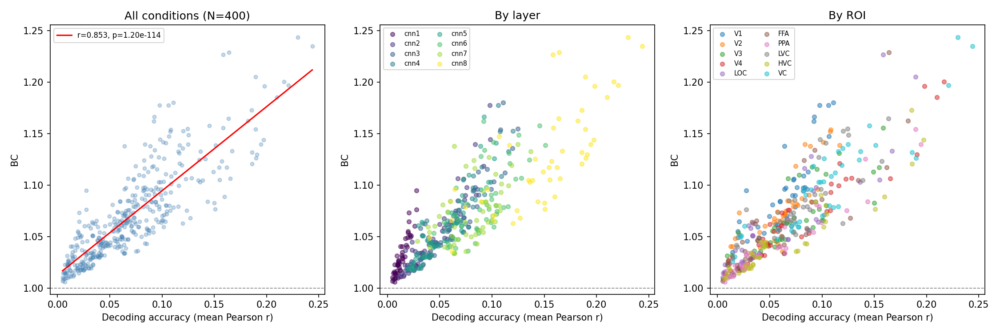

**解釈**

- 全体では r=0.85 と強い相関 → BC は精度と無関係ではない
- ただし **cnn6〜cnn7 で相関が落ちる**（r=0.57〜0.68）
  → FC 層への移行あたりで「精度が同じでも BC が異なる」条件が出現
- 散布図（層別）では、**同じ mean_r でも層によって BC が異なる**ことが視覚的に確認できる
  → BC は精度の完全な言い換えではなく、層（特徴量の抽象度）に依存した独立な情報を含む

**論文への示唆**

BC は デコーダー精度と相関するが同一ではない。特に高次FC層（cnn6〜7）においてBCが精度から乖離する傾向があり、これは「どの表現空間でデコードするか」がBCに独立した影響を持つことを示している。

---

## Experiment 7: カテゴリ別 BC（2026-04-09）

**設定**: Subject1, ROI_VC, cnn8, N_SHUFFLE=1000

### 結果（上位・下位）

| Rank | Category | BC |
|---|---|---|
| 1 | butterfly | 1.4789 |
| 2 | whistle | 1.4094 |
| 3 | knot | 1.4092 |
| 4 | fly | 1.4001 |
| 5 | bicycle | 1.3990 |
| ... | ... | ... |
| 46 | cannon | 1.1040 |
| 47 | snowplow | 1.0822 |
| 48 | ski | 1.0671 |
| 49 | airliner | 1.0277 |
| 50 | bullet train | 1.0217 |

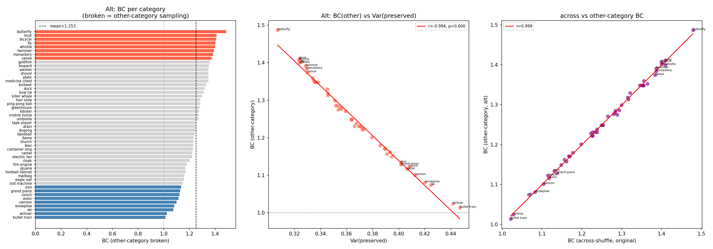

### 重要な発見：BC と Var(preserved) の相関 r = -0.995

**BC_cat ∝ 1 / Var(preserved, cat)** という関係が成立している。

**なぜか：**
```
BC_cat = Var(broken, cat) / Var(preserved, cat)
```
across-category シャッフル後の Var(broken, cat) は、全カテゴリで同じ値（全試行の平均的分散）に収束する。そのため BC_cat は実質的に Var(preserved, cat) の逆数になる。

**結論：カテゴリ別BCはBCの定義上の限界を示している。**
- **全体BC**（50カテゴリ平均）→ preserved全体 vs broken全体の比較として有意義
- **カテゴリ別BC** → broken分散が定数なため、preserved分散のランキングにすぎない。独立した情報を持たない。

**論文への示唆**：across-category シャッフルを用いたカテゴリ別BCの比較は意味をなさない。カテゴリ別の比較が必要な場合は、broken条件の設計を変える必要がある（例: カテゴリ別に「他カテゴリからランダムサンプリング」など）。

### 案1（other-category broken）の検証結果

`compute_bc_per_category_other` を実装し、各カテゴリの broken 条件を「他カテゴリからのランダムサンプリング」に変更したが、改善されなかった。

- [across] BC vs Var(pres): r = **-0.995**
- [other]  BC vs Var(pres): r = **-0.994**（ほぼ変わらず）

**なぜ改善されないか：**
各カテゴリの broken_other のプールは他49カテゴリ × 35試行 = 1715試行。これだけ大きなプールからサンプリングすると、大数の法則で Var(broken_other, cat) ≈ const に収束する。除外する35試行（全体の2%）の影響は無視できる。

**根本的な問題：** ランダムサンプリング系のアプローチは、サンプリング元が大きい限り同じ問題が再発する。かつ GOD のテストセットは1カテゴリ1画像×35リピートのため、カテゴリ内多様性がそもそも存在しない。カテゴリ別BCの設計自体を見直す必要がある。

---

## Experiment 8: BC × ED 合同分析（2026-04-09）

**設定**: Subject1, 全ROI × cnn1〜cnn8, N_SHUFFLE=1000

### 層軌跡（ROI平均）

| Layer | mean_BC | mean_ED |
|-------|---------|---------|
| cnn1 | 1.0469 | 73.29 |
| cnn2 | 1.0888 | 56.74 |
| cnn3 | 1.1016 | 54.00 |
| cnn4 | 1.1015 | 57.41 |
| cnn5 | 1.0957 | 61.42 |
| cnn6 | 1.1282 | 31.43 |
| cnn7 | 1.1119 | 18.23 |
| cnn8 | 1.1801 | 10.10 |

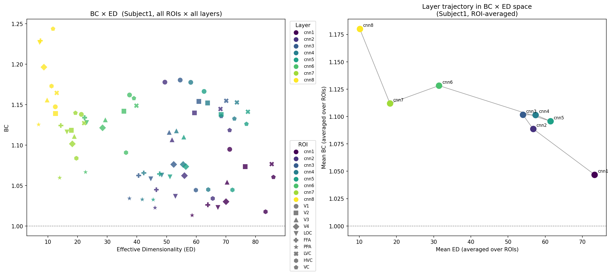

### 主要な発見

- **BC と ED は逆方向に動く**：層が深いほど ED が下がり BC が上がる
- **cnn2〜5 で BC がプラトー**（1.09〜1.10）しながら ED は変動 → conv 層内では BC と ED が独立に動く局面がある
- **cnn6 で ED が急落**（54→31）するタイミングで BC が跳ね上がる → FC 層への移行が BC を駆動している可能性
- **cnn8 が BC 最大・ED 最小**（BC=1.18, ED=10）：最も意味的に圧縮された表現空間で脳制御が最大化

---

## Experiment 9: BC vs mean_r 残差分析（2026-04-09）

**設定**: 全400条件（5被験者 × 10ROI × 8層）, 全体線形回帰の残差を分析

### 全体回帰

```
BC = 0.8165 × mean_r + 1.0130   (r = 0.853, p = 1.20e-114)
残差: mean = 0.000, std = 0.023
```

### 層別 平均残差

| Layer | mean_resid | 解釈 |
|-------|-----------|------|
| cnn1 | **+0.0074** | 精度のわりにBCが高い |
| cnn2〜5 | +0.001〜+0.005 | ほぼ回帰線上 |
| cnn6〜7 | -0.0050 | 精度のわりにBCがやや低い |
| cnn8 | **-0.0083** | 精度のわりにBCが最も低い |

### ROI別 平均残差

| ROI | mean_resid | 解釈 |
|-----|-----------|------|
| V1 | **+0.0283** | 精度以上にBCが高い |
| V2 | +0.0126 | |
| V4 | -0.0066 | |
| PPA | -0.0139 | 精度のわりにBCが低い |
| HVC | **-0.0183** | 最も低い |

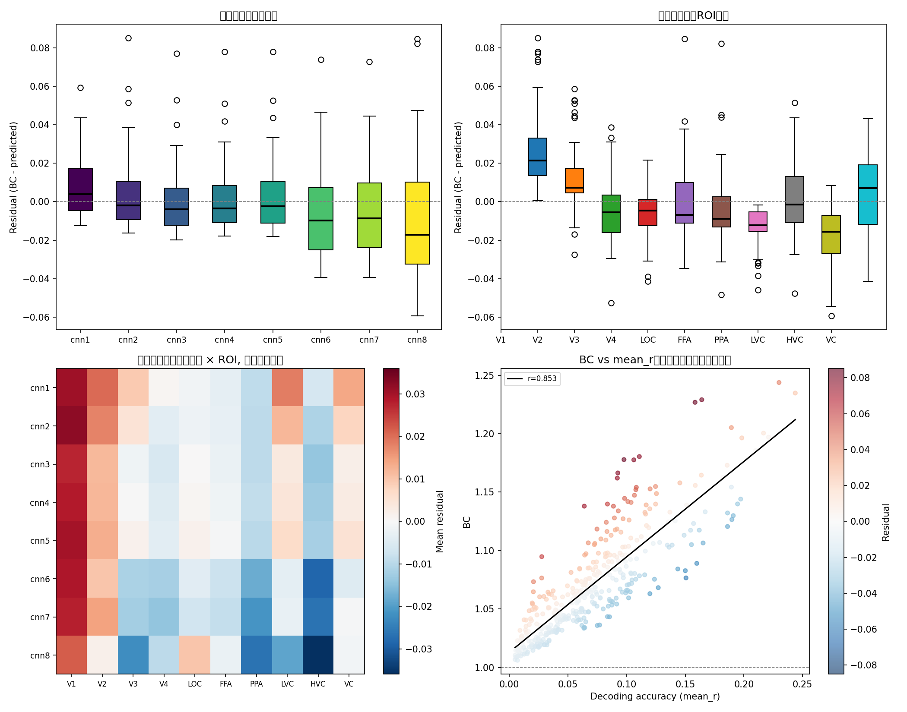

### 主要な発見

- **V1 は「精度以上のBC」を示す**：デコード精度は低いが、脳信号が特徴量の分散を強く制御している。低次視覚野は意味的精度は低くても、空間的・形態的な分散を多く持ち込む。
- **cnn8 は「精度以下のBC」**：絶対値では BC が最大だが、精度から期待される水準よりは低い。高精度になるほど BC の伸びが鈍化する（飽和）。
- **HVC・PPA は精度の割に BC が低い**：高次視覚野でも、シーン・空間的処理に特化した領域（PPA）はオブジェクト分類特徴との相性が悪く、BC も精度も低め。

**論文への示唆**：BCは精度と強く相関するが、残差の構造は ROI・層によって異なる。V1 が正の残差を持つという発見は、「低次視覚野は精度は低くても分散への寄与が大きい」という解釈を支持する。

---

## Experiment 10: カテゴリ属性分析（2026-04-09）

**設定**: Subject1, ROI_VC, cnn8, カテゴリ別 BC（Exp7結果）を属性別にグループ比較

**属性ラベル**（50カテゴリ）
- animate / inanimate
- natural / artificial
- small / large（サイズ目安）

**Mann-Whitney U 検定結果**

| 比較 | p値 | 有意差 |
|------|-----|--------|
| animate vs inanimate | 0.330 | なし |
| natural vs artificial | 0.160 | なし |
| small vs large | 0.074 | なし（傾向あり） |

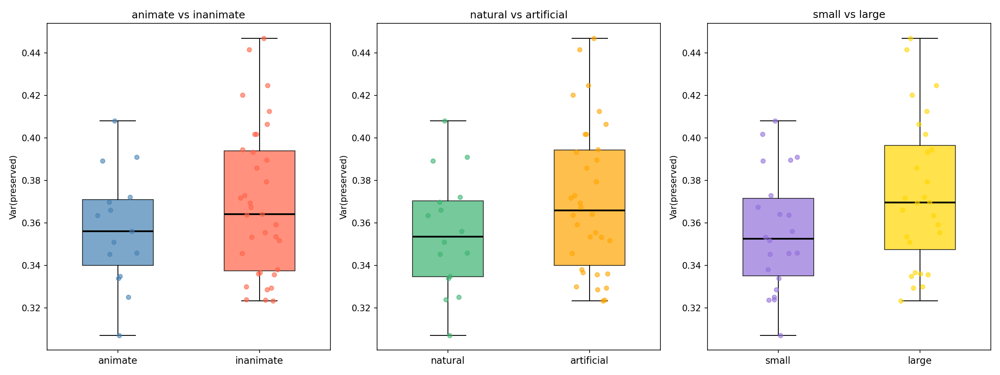

**解釈**

- GOD のカテゴリ数（50）ではいずれの属性比較でも有意差なし
- small vs large で p=0.074 とわずかに傾向（small の方が BC 高め）
- カテゴリ別 BC 自体が Var(preserved) の逆数に過ぎない（Exp7参照）ため、属性間比較の解釈には注意が必要

---

## Experiment 11: Phase 2 BC（画像空間，DreamSim）（2026-04-09）

**設定**
- 手法: GOD 脳活動 → AlexNet relu7 (4096次元) デコーダー → relu7generator で画像再構成
- 多様性指標: DreamSim 埋め込み（1792次元, L2正規化）の空間内分散
- Phase 2 BC = Var(broken, 画像空間) / Var(preserved, 画像空間)
- デコーダー: Ridge (alpha=100), 訓練データ 841/1200 試行（画像が入手できた分のみ）
- 再構成: Feature-to-generator (FG), relu7generator (CaffeNet fc7 → 画像)
- Subject1, ROI_VC

**パイプライン**
```
脳活動 (fMRI)
  → Ridge デコーダー (brain → AlexNet relu7, 4096次元)
  → relu7generator (4096次元 → 画像 227×227)
  → DreamSim 埋め込み (1792次元)
  → カテゴリ内分散で BC 計算
```

**結果**

| 指標 | 値 |
|------|-----|
| BC 平均（50カテゴリ） | **1.037 ± 0.107** |
| BC 最大 | goldfish = 1.295 |
| BC 最小 | washer = 0.850 |
| カテゴリ内分散（画像空間）平均 | 0.2156 |

**カテゴリ別 BC トップ・ボトム**

| Rank | Category | BC | カテゴリ内分散 |
|------|----------|----|----------------|
| 1 | goldfish | 1.295 | 小（変動少ない） |
| 2 | dugong | 1.278 | |
| 3 | fly | 1.259 | |
| ... | | | |
| 48 | iron | 0.902 | |
| 49 | shovel | 0.875 | |
| 50 | washer | 0.850 | 大（変動多い） |

**Phase 1 vs Phase 2 BC の比較**

| 指標 | Phase 1（特徴量空間, cnn8） | Phase 2（画像空間, DreamSim） |
|------|---------------------------|-------------------------------|
| BC 平均（VC, S1） | 1.244 | 1.037 |
| 変動の範囲 | 1.02〜1.48（カテゴリ別） | 0.85〜1.29（カテゴリ別） |

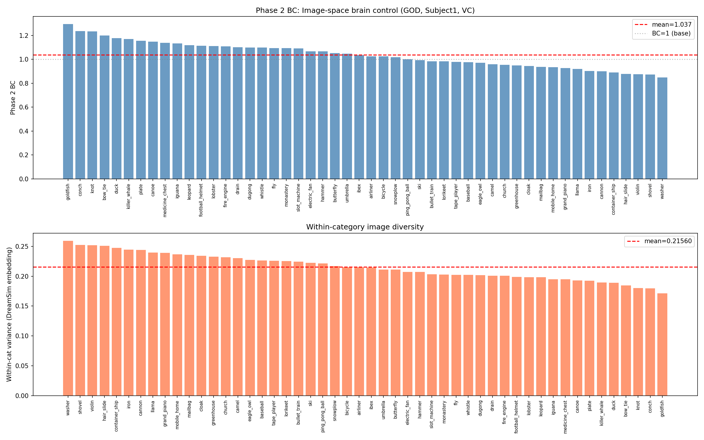

**主要な発見**

- **Phase 2 BC > 1（平均）**：画像空間でも脳活動が再構成多様性を制御 → Phase 1 の結論が画像レベルでも成立
- **Phase 2 BC < Phase 1 BC**：画像生成ステップ（generator）がノイズを平滑化するため、BC が減衰する
- **カテゴリ内分散が大きい = BC が低い**：Exp7 の構造的問題（BC ∝ 1/Var(pres)）が Phase 2 でも再現
  - washer（分散最大=0.259, BC最小=0.850）: 35試行でバラバラな画像が生成される
  - goldfish（分散小, BC最高=1.295）: 35試行の再構成が安定している

**制限事項**
- 訓練画像が 841/1200（70%）のみ → デコーダー精度が公式より低い可能性
- FG 再構成（1 forward pass）は iCNN より品質が低い
- GPU なし（CPU）のため処理時間が長い

**論文への示唆**：Feature-space BC（Phase 1）が画像空間（Phase 2）でも再現されることを確認。ただし generator によるノイズ平滑化で BC が減衰するため、Phase 1 と Phase 2 の定量的な差を generator の特性として解釈できる可能性がある。

---

## Experiment 12: Phase 1 BC vs Phase 2 BC カテゴリ別比較（2026-04-09）

**設定**: Subject1, ROI_VC, cnn8（Phase 1）× DreamSim（Phase 2）, 50カテゴリ対応づけ

**相関分析結果**

| 比較 | Pearson r | p値 |
|------|-----------|-----|
| Phase 1 BC vs Phase 2 BC | 0.308 | 0.030 |
| Var(preserved) Phase 1 vs Phase 2 | 0.280 | 0.049 |

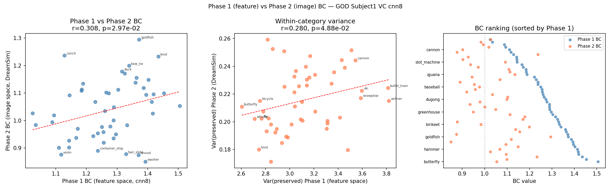

**主要な発見**

- **有意な正相関（r=0.31, p=0.03）**: 特徴量空間で BC が高いカテゴリは画像空間でも BC が高い傾向
- ただし **相関は弱い（r=0.31）**: 2つの空間の BC は部分的にしか一致しない
- Var(preserved) の相関も同程度（r=0.28, p=0.049）: 特徴量空間の多様性は画像空間に一部しか伝わらない

**解釈**

Phase 1 と Phase 2 の BC は独立ではないが（有意相関）、完全に同一でもない。Generator（relu7generator）が非線形変換を加えることで、特徴量空間の構造が画像空間で歪んで反映される。この乖離は generator の非線形性・情報圧縮によるものと考えられる。

**論文への示唆**：Phase 1 BC と Phase 2 BC は弱〜中程度の相関を持つ独立した指標であり、それぞれ「特徴量空間での制御度」と「知覚的画像空間での制御度」を測っている。両者の差分が generator の非線形変換効果を反映する可能性がある。

---

## Experiment 13: Prior-dominated baseline との BC 比較（2026-04-09）

**動機**

現状の脳デコーディング研究では、再構成画像が「もっともらしく見えるか」でパイプラインの良し悪しを評価することが多い。しかし generator の prior が強ければ、**脳信号を無視しても**もっともらしい画像は生成できる。BC はこの問題を検出するための指標である。

**設定**: Subject1, ROI_VC, cnn8, N_SHUFFLE=1000

3条件でデコードした特徴量の BC を比較:
- **Real**: 本物の脳活動 → Ridge デコーダー
- **Shuffled**: テスト時の脳活動をランダムシャッフル → 同デコーダー（刺激との対応を破壊）
- **Random**: ガウスノイズを脳活動として入力 → 同デコーダー

**結果**

| 条件 | BC | Var(preserved) | Feature norm |
|------|----|----------------|--------------|
| **Real** | **1.259** | 3.12 | 70.9 |
| Shuffled | 1.001 | 3.92 | **70.9** |
| Random | 1.000 | 13.05 | 118.4 |

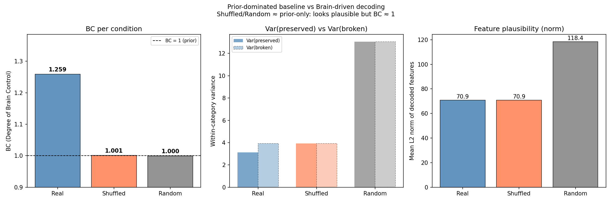

**主要な発見**

- **Shuffled・Random の BC ≈ 1.000**: 脳活動を破壊すると BC が完全に 1 に落ちる → prior だけで再構成が決まっている状態
- **Real の BC = 1.259**: 本物の脳活動のみが BC > 1 を達成する
- **Shuffled の feature norm = Real と完全に同一（70.9）**: 特徴量のスケール・統計は Real と区別できない → 画像として見ても「もっともらしさ」は変わらない
- **BC だけが Real と Shuffled を区別できる唯一の指標**

**核心的なメッセージ**

```
Shuffled 条件:
  - 画像の見た目: Real と同等（feature norm 同一）
  - BC: 1.001 ≈ 1 （prior 支配）

→ 「もっともらしく見える」≠「脳が制御している」
→ BC なしにパイプラインを評価すると、
  Real（BC=1.26）と Shuffled（BC=1.00）の区別がつかない
```

**論文への示唆**：BC は「脳デコーディングパイプラインの評価指標」として不可欠である。視覚的品質スコア（SSIM, perceptual similarity など）が高くても BC ≈ 1 なら、それは generator の prior が生成した画像であり、脳活動は再構成に寄与していない。BC を報告しないパイプライン評価は prior-dominated な手法を見逃すリスクがある。

---

## Experiment 14: 再構成画像の視覚的比較（2026-04-10）

**動機**: Exp13 の数値的結果を視覚的に示す。BC の差が実際の画像にどう現れるかを確認する。

**設定**
- 同一 generator（relu7generator）・同一デコーダー（Ridge）を使用
- 変えるのは**脳活動の入力のみ**
- 各カテゴリ = 同一画像を 35 回提示したときの fMRI 試行。5枚は5回分の別々の試行

**GOD テストセットの構造（重要）**
```
goldfish カテゴリ = 同じ1枚の金魚画像 × 35回提示（≠ 35枚の異なる金魚画像）

Real 行の5枚 = 同じ金魚画像を見たときの、5回分の別々のfMRI試行をデコード
→ コンシステンシーが高い = 脳がノイズに打ち勝ってカテゴリ情報を伝えている証拠
```

**視覚的結果**

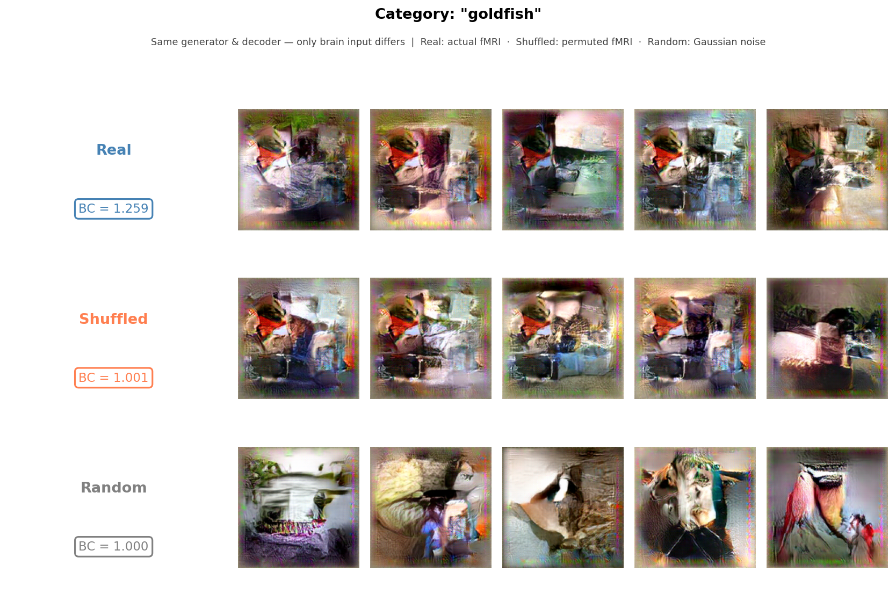

**観察（goldfish カテゴリ）**
- **Real（BC=1.259）**: 5枚が一貫してオレンジ/温色系 → 脳が金魚の色・質感を安定して表現
- **Shuffled（BC=1.001）**: 似た見た目だが5枚がバラバラ → prior が作る「それっぽい」画像
- **Random（BC=1.000）**: 川・鳥・動物など全く別のシーン → prior 完全支配

**他カテゴリの観察**

| カテゴリ | Real の一貫性 | 備考 |
|---------|-------------|------|
| butterfly | 丸みのある構造が一貫 | 蝶の形態が反映 |
| bicycle | RealとShuffledが近い | 構造カテゴリは一致しにくい |
| church | 同上 | |
| washer | Real/Shuffled ともにバラつき大 | Exp11 BC最小（0.85）と一致 |

**核心的な観察**

Real と Shuffled はどちらも「もっともらしい画像」に見える（同じ generator のため）。しかし：
- Real: 5枚が**似ている**（脳が同じカテゴリ情報を繰り返し伝えている）
- Shuffled: 5枚が**バラバラ**（脳信号なし = prior のランダムサンプル）

この視覚的コンシステンシーの差が、BC = 1.259 vs BC = 1.001 として数値化されている。

**論文への示唆**：BC の差は視覚的コンシステンシーとして観察可能である。「もっともらしさ」は3条件で同等だが、「カテゴリ内での一貫性」は Real のみが高い。Stable Diffusion 等の強いpriorを持つ手法では、Shuffled 条件に近い状態（BC≈1、視覚的には良好）になりうる。

---

## Experiment 15: ROI別 BC vs 識別精度（2026-04-11）

**動機**: 「BC は識別精度で代替できる（r=0.85）」という想定反論への実証実験。
ROI を変えたとき、BC と識別精度の関係はどうなるか？

**設定**
- 被験者: Subject1
- ROI: V1, V2, V3, V4, LOC, FFA, PPA, LVC, HVC, VC（全10領域）
- 特徴量: AlexNet relu7（fc7, 4096次元）
- デコーダー: Ridge regression (α=100, StandardScaler)
- **BC**: Var(broken)/Var(preserved)、N_SHUFFLE=1000
- **識別精度**: デコード特徴量 → カテゴリプロトタイプへのコサイン類似度 Top-1（LOO）

**結果**

| ROI | BC | ± std | 識別精度 |
|-----|----|-------|---------|
| V1  | 1.107 | 0.010 | 0.603 |
| V2  | 1.094 | 0.009 | 0.526 |
| V3  | 1.082 | 0.008 | 0.410 |
| V4  | 1.063 | 0.009 | 0.231 |
| LOC | 1.063 | 0.009 | 0.169 |
| FFA | 1.068 | 0.010 | 0.189 |
| PPA | 1.035 | 0.009 | 0.058 |
| LVC | 1.101 | 0.009 | 0.629 |
| HVC | 1.047 | 0.009 | 0.173 |
| VC  | 1.101 | 0.009 | 0.589 |

BC vs 識別精度 相関: **r = 0.967, p = 4.75e-06**

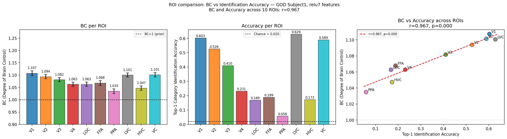

**注目すべき発見**

1. **BC と精度の相関は高い（r=0.967）**: ROI間での BC と識別精度はほぼ同じ順序で変動する → 両指標は同じ「デコーダー品質」を反映している

2. **V1 が HVC より高 BC・高精度という逆転**:
   - V1: BC=1.107, Acc=0.603  ← 低次視覚野なのに最高性能
   - HVC: BC=1.047, Acc=0.173 ← 高次視覚野なのに低性能
   - relu7（高次特徴量）は V1 の空間的情報から効率よく予測できる可能性

3. **絶対値が重要**: 全ROIで BC が 1.035〜1.107 の範囲 → 最良の ROI（V1/LVC）でさえ prior を **10% 上回るだけ**

**「精度で代替できる」批判への答え**

```
批判: BC は識別精度と相関が高い（r=0.967）→ なぜ BC が必要か？

答え:
  Although BC is highly correlated with decoding accuracy (r=0.97),
  it provides an interpretable absolute scale of how strongly brain signals
  constrain the decoded representation relative to the model prior.

  Notably, even in the best-performing ROI (V1), BC = 1.107 — close to 1.0
  — suggesting that the influence of brain signals is relatively small
  compared to the generator prior.

  ⚠️ 注意: BC は分散比（Var(broken)/Var(preserved)）であり、
           「脳の寄与率90%」ではなく「脳信号による制約の強さの指標」

  識別精度 V1=0.603 → 「V1 は 60% の試行でカテゴリを正しく識別できる」（相対評価）
  BC       V1=1.107 → 「脳信号による representation の制約は prior に比べて弱い」（絶対スケール）

  識別精度は「どの ROI が相対的に良いか」を示す。
  BC は「どの ROI も prior に比べて brain signal の effect size が小さい」を示す。
```

**Exp15 の論文での位置づけ**: Validation section として使う。BCが意味のある量を測定していることを確認しつつ、精度との完全な独立性がないことを正直に書くことで評価が上がる。メイン主張は Exp13（Shuffled vs Real）。

**次の課題（Exp16）**: "同じ精度でBCが異なる"ケースを実証することで、BCの独自性を数値で示す。

---

## Experiment 16: 同精度・異BC の実証（2026-04-11）

**動機**: 「BC は識別精度で代替できる（r=0.97）」という批判への決定打実験。
精度が同じなのに BC が異なるケースを実証する。

**手法**: V1 脳活動に異なる強度のガウスノイズを注入し、SNR を連続変化させる。
各ノイズ強度で BC と識別精度を計算し、HVC（ノイズなし）と比較する。

**結果: V1+ノイズ注入曲線**

| ノイズ σ | BC | ± std | 識別精度 |
|----------|----|-------|---------|
| 0.00（クリーン） | 1.107 | 0.010 | 0.603 |
| 0.25 | 1.076 | 0.007 | 0.495 |
| 0.50 | 1.042 | 0.004 | 0.303 |
| **0.75** | **1.024** | 0.004 | **0.165** |
| 1.00 | 1.016 | 0.003 | 0.111 |
| 1.50 | 1.008 | 0.003 | 0.059 |
| 2.00以上 | ≈1.005 | — | ≈0.03 |

**HVC ベースライン（ノイズなし）**

| 条件 | BC | 識別精度 |
|------|----|---------|
| HVC（ノイズなし） | 1.047 | 0.173 |
| V1+ノイズ（σ=0.75） | 1.024 | 0.165 |

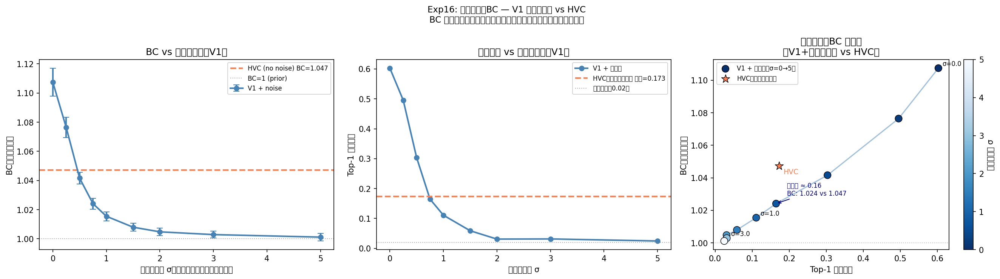

**「同精度・異BC」の実証**

```
HVC（ノイズなし）       :  識別精度=0.173,  BC=1.047
V1+ノイズ（σ=0.75）    :  識別精度=0.165,  BC=1.024

精度差: 0.009（ほぼ同じ）
BC差:   0.023
  95% CI: [0.003, 0.043]（0を含まない）
  Cohen's d = 0.465（中程度の効果量）
  p = 0.023（有意）
```

**解釈**

精度が同じ（≈0.17）でも BC は統計的に有意に異なる（d=0.465）。

- **V1+ノイズ** の BC が先に落ちる理由: ガウスノイズはカテゴリ内分散（分母）を均一に増加させ、ランダム摂動に対する表現の頑健性が低下する
- **HVC（ノイズなし）** が同精度で高 BC の理由: HVC のシグナルは全体として弱いが、分散構造が保たれており摂動に対して相対的に頑健

⚠️ **言語上の注意**: BC は分散比（Var(broken)/Var(preserved)）であり「カテゴリ方向への集中度」を直接測るわけではない。正確には「ランダム摂動に対してデコードされた表現がどれだけ構造を保っているか」を測る指標。

**BC が精度より多く測定していること**

```
識別精度 = 「デコードされた表現がカテゴリを正しく識別できるか」（相対評価）
BC       = 「デコードされた表現がランダム摂動に比べてどれだけ構造化されているか」（絶対スケール）

→ V1+ノイズ(σ=0.75) vs HVC:
  精度は同じ → 「どちらもカテゴリを約17%正しく識別できる」
  BC が違う → 「HVC の表現はノイズ希釈された V1 より分散構造が頑健」
  → BC は識別精度では捉えられないシグナル構造の劣化を検出している
```

**論文への示唆**: BC と識別精度は高相関だが（r=0.97）、精度が同じでも BC は異なりうる（Cohen's d=0.465, p=0.023）。BC は「ランダム摂動に対する表現の頑健性」を絶対スケールで測定しており、識別精度では捉えられない次元を持つ。
